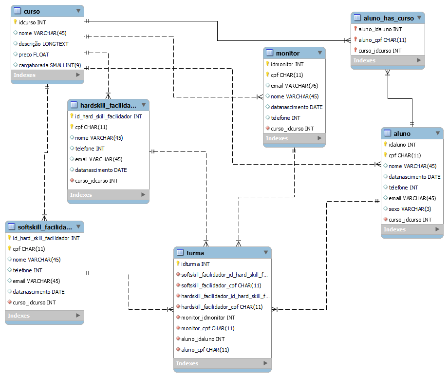

<h1 align="center"> Sistema de acompanhamento Resilia </h1>

## 👉 Contexto

 A Resilia está pensando em lançar um novo sistema de acompanhamento e para isso precisa de ajuda para modelar um banco de dados que vai armazenar seus <strong>cursos, turmas e alunos</strong>.

## 🤔 Perguntas a serem respondidas:

- Existem outras entidades além de cursos, turmas e alunos?
   - Sim. Foram adicionadas as entidades <strong>facilitador_softskill, facilitador_hardskill</strong> e <strong>monitor</strong>

- Quais são os principais campos e tipos?
  - Os principais campos são <strong>ID</strong> e <strong>CPF</strong>. O tipo do <strong>ID</strong> sempre é dado como PK e o <strong>CPF</strong> fica como uma chave alternativa.

- Como essas entidades estão relacionadas?
  - As entidades têm relacionamento <strong>1:n</strong> e <strong>n:m</strong>
